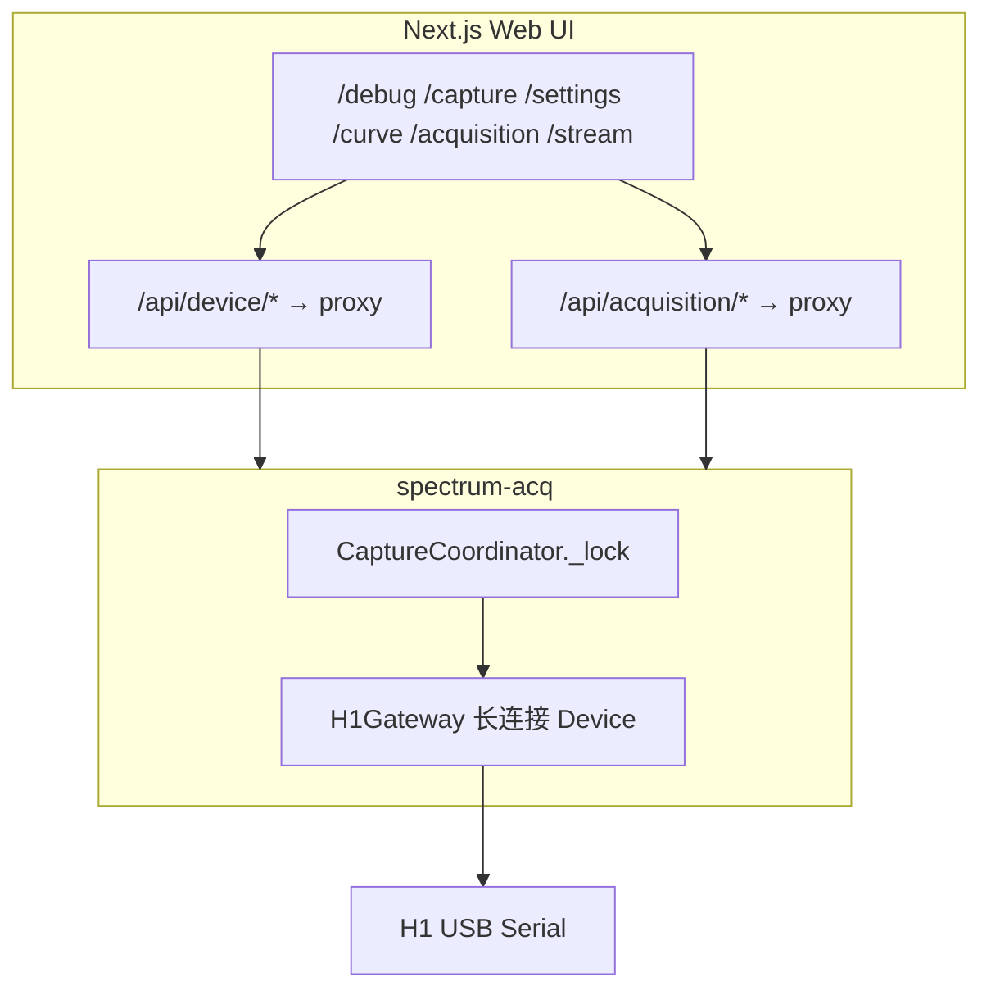

# H1 串口网关：acquisition 独占 + Web UI 代理

**日期**: 2026-06-01  
**状态**: 已实现  
**关联**: [2026-05-31 树莓派多模态采集设计](./2026-05-31-raspberry-pi-leaf-multimodal-capture-design.md) §3（Python 服务是唯一硬件主控）

## 1. 背景与问题

2026-05-31 设计已明确：**Python acquisition 服务是唯一硬件主控，Next.js 不直接访问串口**。当前实现偏离该原则：

- `spectrum-acq` 通过 `H1DeviceAdapter` 访问 `/dev/ttyUSB0`
- Web UI 的 `device-manager.ts` 通过 `@h1/sdk` + `serialport` 独立访问同一串口
- `GET /api/connection` 的 `ensureAutoConnect()` 会在后台自动占串口

Linux 串口只能被一个进程可靠独占。两路并行访问导致 acquisition `/devices` 返回 `error`（`multiple access on port?`），采集页 H1 显示 **异常**。

用户确认采用 **方案 A**：树莓派上**所有 H1 操作**均经 acquisition 网关，Web UI 只做 HTTP 代理。

## 2. 目标与非目标

### 2.1 目标

- `spectrum-acq` 成为 H1 串口的**唯一**打开者（进程级独占）。
- 扩展 acquisition REST/SSE API，覆盖现有 Web UI `/api/device/*` 全部能力。
- Web UI 路由改为 upstream 代理（与现有 `/api/acquisition/*` 同模式），**不再**在 Pi 上打开串口。
- 统一顶部连接栏：所有页面显示 acquisition 设备状态，移除「本机 H1 调试连接」侧栏。
- 保持现有前端页面 URL 与 JSON 契约不变（`/debug`、`/capture`、`/settings`、`/curve` 等继续调用 `/api/device/*`，由 Next 转发到 acquisition）。

### 2.2 非目标

- 不改变多模态采集 `/capture`、样本存储、D455 逻辑。
- 不新增独立 `h1-bridge` 微服务。
- 不在本 spec 内重构 H1 Python SDK 公共 API。
- 不在 Pi 上保留 Web UI 直连串口路径（Mock 调试改走 `spectrum-acq --mock`）。

## 3. 架构

```text
Browser
   |
   |  /api/device/*  /api/acquisition/*
   v
Next.js Web UI  (只做 HTTP 代理，不 import serialport)
   |
   |  ACQUISITION_API_BASE_URL=http://127.0.0.1:8000
   v
spectrum-acq  (CaptureCoordinator + H1Gateway)
   |
   |  单例 h1_sdk.Device，threading.RLock
   v
/dev/serial/by-id/usb-1a86_USB_Serial-if00-port0
```



## 4. acquisition 侧设计

### 4.1 H1Gateway：长连接 + 命令封装

新增 `spectrum_acq/devices/h1_gateway.py`（或扩展 `H1DeviceAdapter`），职责：

1. **启动时**打开 `h1_sdk.Device(port, timeout=...)`，进程生命周期内保持连接（`close` 仅在服务退出时调用）。
2. 所有 H1 命令经 **同一把锁** 序列化（复用 `CaptureCoordinator._lock`，或 Gateway 内部 RLock + Coordinator 在 capture/stream 时仍用现有 `_lock` —— 推荐 **单一锁在 Coordinator**，Gateway 方法由 Coordinator 在持锁上下文调用）。
3. 将 SDK 类型转为与 Web UI `serializeFrame` 一致的 JSON（camelCase，plain `number[]` 数组）。

`H1DeviceAdapter` 当前每次 `with self._device()` 开关串口；改造后：

- `H1DeviceAdapter` 持有 `H1Gateway` 引用，或直接被 `H1Gateway` 替换。
- `status()` / `capture_auto()` / `stream()` / 新调试命令均走同一 `Device` 实例。

连接失败时：`status()` 返回 `DeviceStatus.ERROR` + `detail.error`（保持现有 `/devices` 行为）。后台可选 **重连循环**（每 30s 尝试 reopen）—— v1 先做「下次请求时 lazy reopen」，避免过度设计。

### 4.2 互斥与 busy 语义

| 操作 | 锁策略 | 冲突 HTTP |
|------|--------|-----------|
| `GET /devices` | 非阻塞尝试；失败则返回 `_last_h1_status` 或 busy 占位 | 200 + cached/busy |
| `POST /capture`（多模态） | 阻塞 acquire 5s | 409 `capture busy` |
| `GET /h1/stream` | 阻塞 acquire 5s | SSE `event: error` |
| `POST /h1/capture` 等调试命令 | 阻塞 acquire 5s | 409 `capture busy` |
| 并发两个 `/h1/stream` | 第二个拒绝 | 409 或 SSE error |

与现 `CaptureCoordinator` 行为一致，扩展锁覆盖全部 `/h1/*` 路由。

### 4.3 新增 REST / SSE 端点

路径前缀 **`/h1/`**，JSON 错误格式与 Web UI 一致：`{ "error": "...", "code"?: number, "cmdType"?: number }`（SDK `DeviceError` 映射 code/cmdType）。

| 方法 | 路径 | 说明 | 对应 Web UI |
|------|------|------|-------------|
| GET | `/h1/info` | `{ serialNumber, wavelengthRange: { start, end } }` | `/api/device/info` |
| GET | `/h1/exposure` | `{ mode: "auto"\|"manual", timeUs, maxTimeUs }` | GET exposure |
| PATCH | `/h1/exposure` | body 同 Web UI，返回同上 | PATCH exposure |
| GET | `/h1/cie-mode` | `{ mode: "cie1931_2"\|... }` | GET cie-mode |
| PUT | `/h1/cie-mode` | body `{ mode }`，返回同上 | PUT cie-mode |
| PUT | `/h1/working-mode` | body `{ mode: "streaming"\|"trigger" }` | working-mode |
| POST | `/h1/sleep` | `{ ok: true, state: "sleeping" }` | sleep |
| POST | `/h1/wake` | `{ ok: true, state: "awake" }` | wake |
| POST | `/h1/capture` | query `tm30=1`；返回 `SerializedSpectrumFrame` | capture |
| GET | `/h1/stream` | 已有；对齐 frame JSON 与 `serializeFrame` | stream（debug 页若需要） |
| POST | `/h1/efficiency-curve` | body `{ ratios: number[] }` → `{ ok, count }` | efficiency-curve |
| POST | `/h1/efficiency-curve/verify` | `{ ok: true }` | verify |
| POST | `/h1/efficiency-curve/reset` | `{ ok: true }` | reset |

**Frame JSON 契约**（与 `webui/src/lib/serialize.ts` 一致）：

```json
{
  "exposureStatus": 0,
  "exposureTimeUs": 5000000,
  "photometric": { "...": 0.0 },
  "blueHazard": { "...": 0.0 },
  "nir": { "...": 0.0 },
  "plant": { "...": 0.0 },
  "tm30": null,
  "spectrumCoefficient": 1,
  "wavelengthStart": 340,
  "rawSpectrum": [0, 1, 2],
  "actualSpectrum": [0.0, 1.0],
  "wavelengths": [340, 341, 342]
}
```

现有 `spectrum_frame_to_stream_payload()` 已接近该形状；统一提取为 `spectrum_acq/devices/h1_serialize.py` 的 `frame_to_json(frame, wavelength_start)`，供 stream 与 capture 共用。

**CIE mode 字符串映射**（与 Web UI `cie-mode/route.ts` 相同）：

- `cie1931_2`, `cie1964_10`, `cie2015_2`, `cie2015_10`

### 4.4 实现落点

- `spectrum_acq/api/app.py`：注册 `/h1/*` 路由，委托 `coordinator.h1_*` 方法。
- `spectrum_acq/capture/coordinator.py`：新增 `h1_info()`, `h1_capture_single()`, `h1_set_exposure()`, … 包装 Gateway。
- `acquisition/tests/test_api.py`：mock H1 下覆盖新端点；硬件测试可选 `@pytest.mark.hardware`。

## 5. Web UI 侧设计

### 5.1 统一代理层

新增 `webui/src/lib/acquisition-proxy.ts`：

- `proxyToAcquisition(request, upstreamPath)` — 复用 `[...path]/route.ts` 的逻辑（method、query、body、SSE 响应头）。
- 所有 `/api/device/**/route.ts` 改为一行委托：`return proxyToAcquisition(request, '/h1/...')`。

路径映射示例：

| Next route | Upstream |
|------------|----------|
| `/api/device/info` | `GET /h1/info` |
| `/api/device/capture` | `POST /h1/capture?...` |
| `/api/device/stream` | `GET /h1/stream?...` |
| `/api/device/stream/stop` | **删除或改为 410** — acquisition stream 随客户端断开结束，无独立 stop API |
| `/api/device/exposure` | `GET\|PATCH /h1/exposure` |
| … | … |

### 5.2 移除 Pi 串口占用

- **删除** `device-manager.ts` 在 production 路径上的使用（或整文件保留仅给单元测试 / 未来 `H1_DIRECT=1` 开发机，默认不编译进 Pi 部署）。
- **删除** `/api/connection` 的 POST/DELETE 串口连接与 `ensureAutoConnect()`。
- `GET /api/connection` 改为返回 acquisition 派生状态：

```json
{
  "connected": true,
  "mode": "gateway",
  "port": null,
  "openedAt": null,
  "serialNumber": "H11B6V10534FFPD-211-0021",
  "status": "ready"
}
```

其中 `connected` = `devices.h1.status === 'ready'`，供 `/debug` 等页判断「是否可用」。

### 5.3 连接栏统一

- `ConnectionBar`：**始终**使用 `AcquisitionConnectionBar`（移除 `H1ConnectionBar` 与 mock/serial 侧栏）。
- `/debug`、`/capture`、`/settings`、`/curve` 依赖 `connected` 时改为读 `/api/connection` 或 `/api/acquisition/devices`（二选一，推荐后者 + connection 轻量包装）。

### 5.4 依赖清理

- Pi 部署的 `spectrum-webui.service` 无需 `H1_PORT` / `H1_AUTO_CONNECT`。
- `webui/README.md` 更新：本机调试页亦经 acquisition；Mock 用 `spectrum-acq --mock`。
- `package.json` 中 `serialport` 可保留（SDK dev）或移到 optional；Pi 运行时 Next 不再 `require('serialport')`。

### 5.5 `/api/device/stream/stop`

acquisition 的 `/h1/stream` 在 SSE 客户端断开时释放锁（与现 `stream_h1` 一致）。Web UI：

- 删除 `stream/stop` 路由，或返回 `{ ok: true, note: "close EventSource client" }` 空操作。
- 若 debug 页有本地 stream UI，改为 EventSource 连 `/api/device/stream` → 代理 `/h1/stream`。

## 6. 错误处理

| 场景 | acquisition | Web UI 展示 |
|------|-------------|-------------|
| 串口断开 | `devices.h1.status=error`, detail.error | H1 异常 + 错误文案 |
| capture/stream 占锁 | 409 / SSE error `capture busy` | toast 提示稍后重试 |
| SDK DeviceError | `{ error, code, cmdType }` | 同现有 api-errors |
| acquisition 进程 down | proxy 502 | 采集服务离线 |

## 7. 测试计划

1. **单元**：`frame_to_json` 与 Node `serializeFrame` 快照对比（mock frame）。
2. **API**：`test_api.py` 在 `--mock` 下跑通全部 `/h1/*`。
3. **集成（Pi）**：
   - 重启 `spectrum-acq` + `spectrum-webui`
   - `/acquisition` H1 显示已连接
   - 同时打开 `/debug` 单帧采集 — H1 仍为 ready
   - `/settings` 改曝光后 `/devices` 反映新值
   - `/stream` 与 `/capture` 不并发（先 stream 再 capture 应 busy 或顺序正常）
4. **回归**：`fuser /dev/ttyUSB0` 仅 `spectrum-acq` 进程。

## 8.  rollout

1. 实现 acquisition `/h1/*` + Gateway 长连接。
2. Web UI 代理切换 + 连接栏统一。
3. 删除 auto-connect；文档与 systemd env 清理。
4. Pi 上重启两个 user service，验证 §7.3。

## 9. 开放问题（实现时默认决策）

| 问题 | 默认 |
|------|------|
| Gateway 断线是否自动重连 | v1：下次持锁操作前 lazy reopen |
| 开发机无 acquisition | 文档要求先 `spectrum-acq --mock`；不保留 Web UI 直连 |
| debug 页实时流 | 代理 `/h1/stream`；与 `/stream` 页共用 SSE 契约 |

---

**请复核本 spec**。确认后进入 implementation plan（按 acquisition → webui → deploy/docs 顺序分 PR）。
